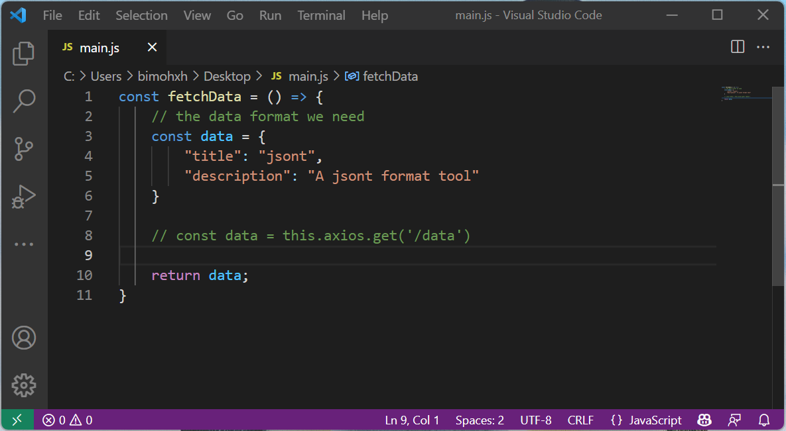
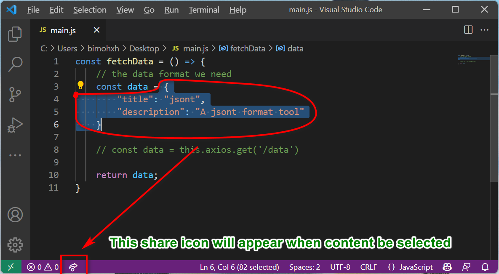
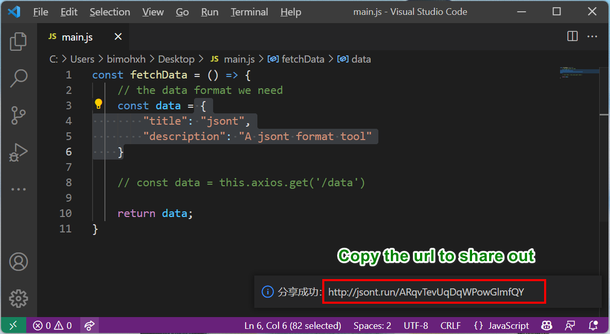
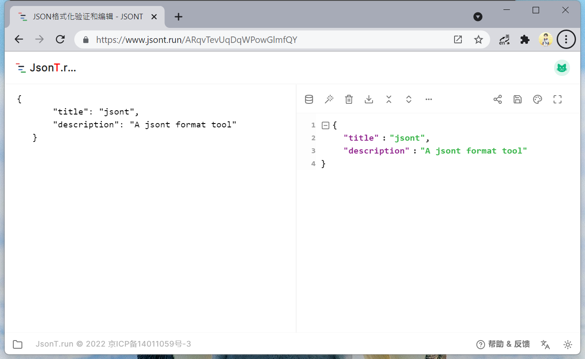

# About

This extension provide a one-click feature to share your selected json content to others by JSONT ( https://www.jsont.run )

# How to use

For example I have the following code, before the API completed, I should make mock data structure for test.

Then I want to tell the backend developer the data structure, I will copy and send to he directly. But if the structure is complex, I can select the data

And will appear a share icon at left of the bottom bar, just click the icon

A share success message will appear at right bottom, with a url, just copy the url and send it out. Then open at browser

# Secure

We will keep your data private and safety, and the data on the server will be stored just for 1 hour, so you shoud share it as soon as possible. 

# Performance

We will validate if the content selected is a JSON format before share, but this validation will not be triggered once the selection changed. We only validate when you click the share icon, so don't worry about the extension will affect your development.